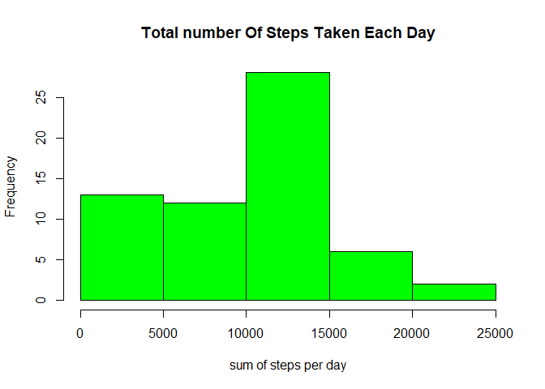
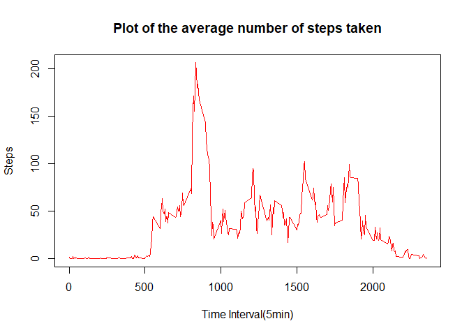
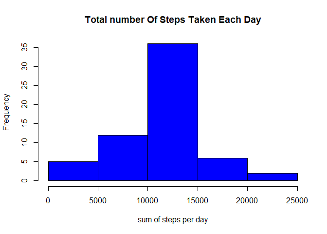
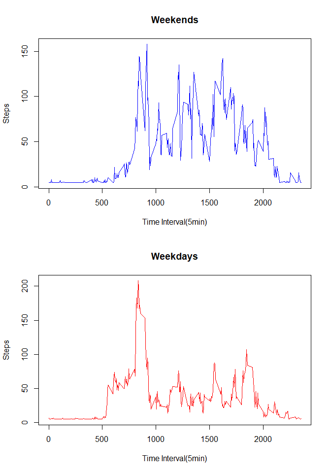

## Loading and preprocessing the data  


```r
unzip("activity.zip")

data <- read.csv("activity.csv")

str(data)
```

```
## 'data.frame':	17568 obs. of  3 variables:
##  $ steps   : int  NA NA NA NA NA NA NA NA NA NA ...
##  $ date    : Factor w/ 61 levels "2012-10-01","2012-10-02",..: 1 1 1 1 1 1 1 1 1 1 ...
##  $ interval: int  0 5 10 15 20 25 30 35 40 45 ...
```


## What is mean total number of steps taken per day?


**Step 1**  

Calculation of the total number of steps taken per day and plotting of the histogram


```r
totals <- tapply(data$steps, data$date, sum, na.rm=T)

hist(totals, main = "Total number Of Steps Taken Each Day", col = "green", xlab = "sum of steps per day")
```

<!-- -->

**Answer to the question**  

Calculation and report of the mean total number of steps taken per day

```r
dailymean <-mean(totals)

dailymean
```

```
## [1] 9354.23
```

Calculation and report of median total number of steps taken per day

```r
dailymedian <- median(totals)

dailymedian
```

```
## [1] 10395
```


## What is the average daily activity pattern?

**Step 1**  

Making a time series plot  of the 5-minute interval and the average number of steps taken, averaged across all days


```r
tint <- tapply(data$steps, data$interval, mean, na.rm=T)

plot(tint~unique(data$interval), type="l", col="red", main="Plot of the average number of steps taken", xlab="Time Interval(5min)", ylab = "Steps")
```

<!-- -->

**Step 2**  

From the graph, here is the 5 minutes interval containing the maximum number of steps


```r
ms <- tint[which.max(tint)]

ms
```

```
##      835 
## 206.1698
```


## Imputing missing values

**Step 1**

Calculation and report of the total number of missing values in the dataset


```r
any(is.na(data))
```

```
## [1] TRUE
```

```r
colSums(is.na(data))
```

```
##    steps     date interval 
##     2304        0        0
```

```r
pmissing <- function(x){
    sum(is.na(x)/length(x)*100)
}

apply(data, 2, pmissing)
```

```
##    steps     date interval 
## 13.11475  0.00000  0.00000
```

We can see that 13% of data is missing from the step column.  

**Step 2**  

Here is the strategy for filling in all of the missing values in the dataset using the **mice package**. The method used is the uncodtional mean and 3 as the number of multiple imputation.A new dataset created will be named fdata which is the original dataset except the missing values are filled in.


```r
library(mice)

idata <- mice(data = data, m=3, method = "mean", seed = 1)
```

```
## 
##  iter imp variable
##   1   1  steps
##   1   2  steps
##   1   3  steps
##   2   1  steps
##   2   2  steps
##   2   3  steps
##   3   1  steps
##   3   2  steps
##   3   3  steps
##   4   1  steps
##   4   2  steps
##   4   3  steps
##   5   1  steps
##   5   2  steps
##   5   3  steps
```

```r
fdata <- complete(idata, 2)

colSums(is.na(fdata))
```

```
##    steps     date interval 
##        0        0        0
```
We can see that there are no missing values in all columns of the new dataset.   

**Step 3**  

Generation of a histogram of the total number of steps taken each day

```r
ftotals <- tapply(fdata$steps, fdata$date, sum)

hist(ftotals, main = "Total number Of Steps Taken Each Day", col = "blue", xlab = "sum of steps per day")
```

<!-- -->


**Step 4**  

Calculation and report of the mean total number of steps taken per day


```r
fdailymedian <- median(ftotals)

fdailymedian
```

```
## [1] 10766.19
```


Calculation and report of the median total number of steps taken per day


```r
fdailymean <-mean(ftotals)

fdailymean
```

```
## [1] 10766.19
```

**Conclusion**  
A comparison of the mean and median when missing values are filled up and when they are not shows that the mean and the median has increased. The impact of missing values s that when they are removed, there is loss of information and indeed some kind of bias introduced. 


## Are there differences in activity patterns between weekdays and weekends?
Here are the steps that can help answer this question  

**Step 1**
Creation of a factor variable and spliting of the dataset into


```r
fdata$date<-as.Date(fdata$date)

fdata$day<-weekdays(fdata$date)

fdataweekdays<-fdata[(!fdata$day %in% c("Saturday","Sunday")),]

fdataweekend<-fdata[(fdata$day %in% c("Saturday","Sunday")),]
```

**Step 3**  

Generation of a panel plot containing a time series plots of the 5-minute interval and the average number of steps taken, averaged across all weekday and weekend. 


```r
par(mfrow =c(2,1))

tint1 <- tapply(fdataweekend$steps, fdataweekend$interval, mean)

plot(tint1~unique(fdataweekend$interval), type="l", col="blue", main="Weekends", xlab="Time Interval(5min)", ylab = "Steps")

tint2 <- tapply(fdataweekdays$steps, fdataweekdays$interval, mean)

plot(tint2~unique(fdataweekdays$interval), type="l", col="red", main="Weekdays", xlab="Time Interval(5min)", ylab = "Steps")
```

<!-- -->

**Answer**  

A close look at the two plots show a variation of activites during the weekends and weekdays.From the plots, it is clear that the activities are high during the weekdays as compared to weekends.


